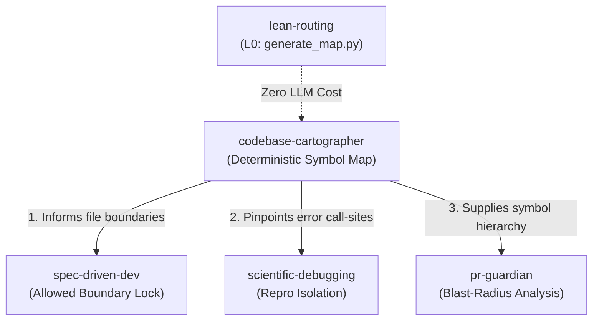

# Codebase Cartographer Skill

This skill enforces disciplined codebase exploration. It eliminates the "blind full-file read" pattern by generating a deterministic structural map of symbols and dependencies before any deep file inspection.

## The Cardinal Exploration Rule

> **NEVER read dozens of full files to explore a codebase. Always run `generate_map.py` or inspect the symbol skeleton first.**

Full-file dumps pollute context windows, degrade model reasoning, and waste tokens.

---

## Inter-Skill Interaction & Automatic Triggering

`codebase-cartographer` acts as the sensory radar for all other AgentForge skills:



1. **Triggered before `spec-driven-dev`**:
   - When asked to plan or implement a new feature, run cartographer first to discover existing modules and accurately declare the **Allowed File Boundary**.
2. **Triggered before `scientific-debugging`**:
   - When investigating a stack trace, use cartographer to find caller hierarchies without reading hundreds of lines of irrelevant implementation.
3. **Triggered alongside `pr-guardian`**:
   - Cartographer's symbol index feeds `pr-guardian`'s blast-radius caller analysis.
4. **Triggered via `lean-routing`**:
   - Any exploration request (`map`, `explore`, `architecture`, `overview`, `scan`) routes directly to `generate_map.py` (L0_DIRECT).

---

## 4-Step Protocol

```text
Step 1: Structural Skeleton Extraction (L0: generate_map.py)
  │  Execute generate_map.py to extract file tree, line counts, and class/function symbols.
  ▼
Step 2: Entry Point & Dependency Identification (L1: cheap-ops)
  │  Identify core entry points (main, index, app, config) and key dependencies.
  ▼
Step 3: Targeted Reading (L0 / L1)
  │  Only read specific lines (StartLine/EndLine) of files relevant to the current goal.
  ▼
Step 4: Output / Cache Repo Map (L1: cheap-ops)
  │  Generate or update repo-map.md as a persistent guide for the project.
```

---

## Deliverable: Repo Map

Outputs a structured `repo-map.md`:
- **Architecture Overview**
- **Core Entry Points**
- **Module & Symbol Directory**
- **Key Data Flows**
